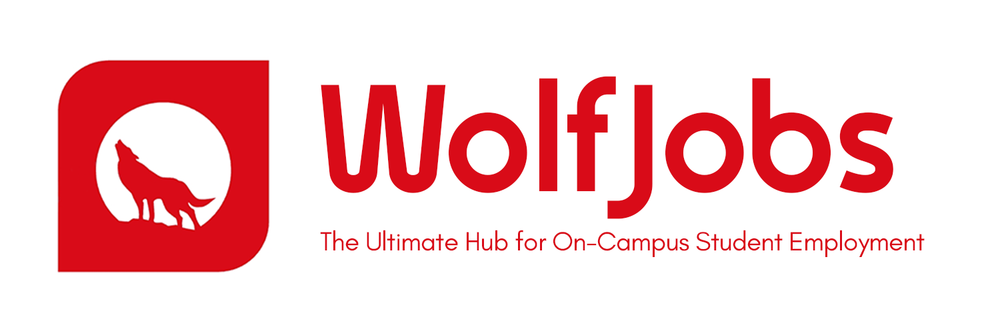
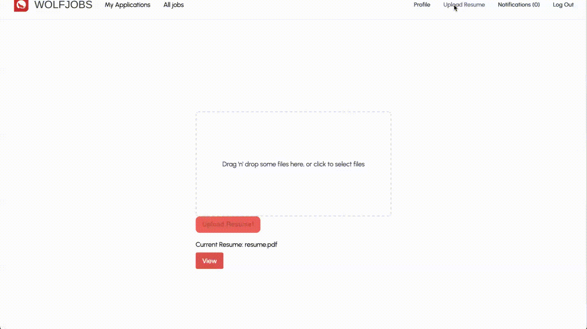
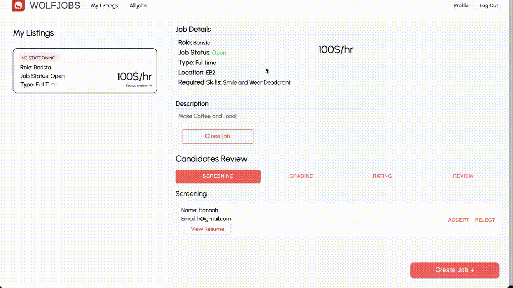
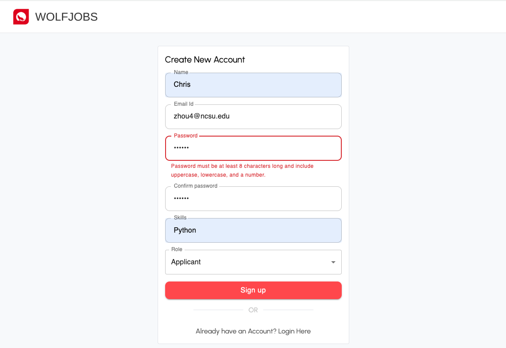
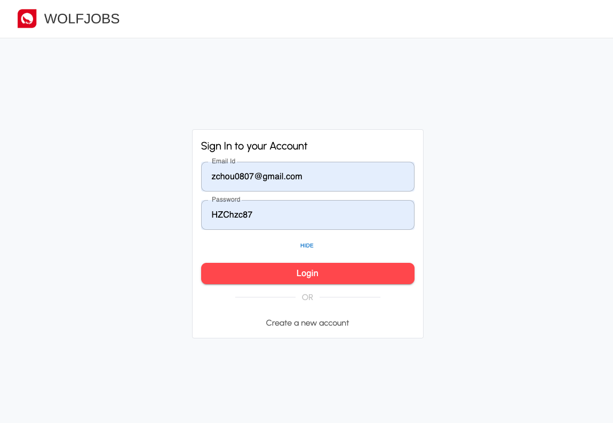
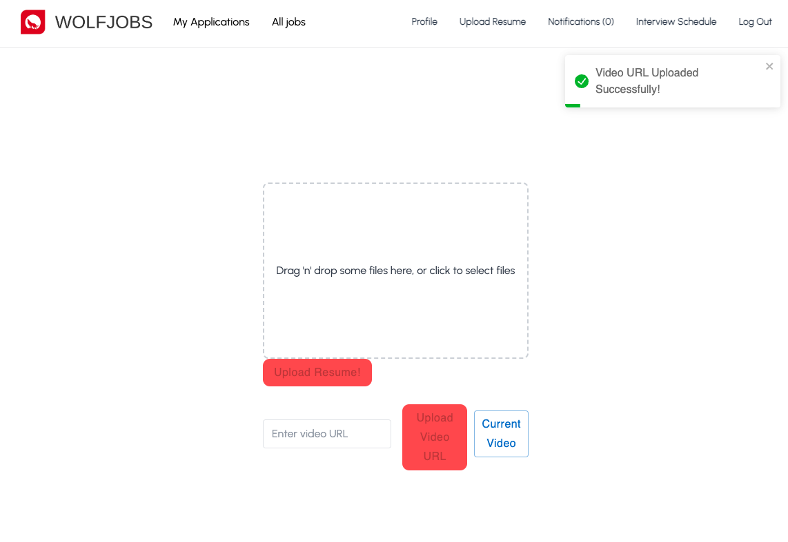

<!--  -->
<!-- the tool used to generate the backend coverage badge, just run npm run coverage:badge from home directory with  where you want the badge to be generated in the README.
https://github.com/H3nSte1n/coverage-badge-creator/blob/main/README.md >

# Tech Stack 
<!-- Really Good Reference: https://github.com/Ileriayo/markdown-badges -->

#### Code Coverage
**Frontend Coverage:**
\
**Backend Coverage:**

#### Backend Technologies

#### Frontend Technologies

#### Styling

#### Testing

#### Package Management

#### CI/CD

#### Code Formatting and Static Analysis

# Support!

If you have ideas, questions, or comments, please let us know in the [discussions](https://github.com/SE-Fall-2024/WolfJobs/discussions) tab!

# What's New

- Updated previous GitHub Actions and implemented new GitHub Actions
    - They are documented and described [here](https://github.com/SE-Fall-2024/WolfJobs/blob/master/GitHubActions.md).
- Containerization of Entire Application! This provides a seamless process to build the application.
- Minor changes to UI to match [style guide](https://www.figma.com/file/sqt0gh5H7bZEkryKZ9jFnK/WolfJobs).
- Implemented Prettier formatting and EsLinting for style consistency and static analysis
- Used In-Memory MongoDB databases to create a new MongoDB database in memory when testing the backend every time
- Fixed backend tests to no longer timeout and implemented a test suite of backend tests using ^
- Updated and fixed resume uploading/viewing capabilities

### Documented the application architecture in a software architecture diagram

NOTE: Note about routes/v1/index.js step
From the backend/index.js file, it points to the /routers folder which contains an index.js file that points to another index.js which checks a user.js file for API endpoints, and then checks the final routes/api/v1/index.js and routes/api/v1/user.js. The different index.js files point to each other while checking the same level user.js files for API endpoints until it hits the routes/v1/user.js which contains the majority of the API endpoints. It took us a while to figure this out and we wanted to document how it worked.

# Presentation Video

# About WolfJobs

Eager to dive into a side hustle or seize a full-time job opportunity? Look no further than WolfJobs. Our platform is the ultimate connector between recruiters in need of talent for both short-term and full-time roles and candidates seeking the freedom to choose. Dive in, earn your share, and opt out whenever you want – or stay on for a longer journey!

At the heart of our bustling campus, WolfJobs stands out as the top student employment portal. Whether you're on the hunt for a short-term tech project, a part-time shift at a campus dining hall, or a full-time position that offers stability and growth, WolfJobs has a spot just for you.

[Demo Video](https://youtu.be/_9WBt_3El-U)

# Why WolfJobs?

At WolfJobs, it’s not just about work – it's about joining a vibrant pack where every wolf (err, student!) counts. Step in and find your howl!🐺🎉

- **Competitive & Rewarding:** As part of the WolfJobs family, we pride ourselves on offering competitive wages paired with flexible schedules. Your time is valuable, and we recognize that.

- **Holistic Growth & Learning:** With our commitment to fostering a culture rich in learning and opportunity, every job position at WolfJobs paves the way for personal and professional growth.

- **A Confluence of Values:** Our foundation rests on unwavering values: integrity, respect for diversity, responsibility, stewardship, and relentless pursuit of excellence. Every job posted resonates with these ideals, ensuring a harmonious and enriching work environment.

- **Inclusivity & Belonging:** At WolfJobs, every student is a valuable asset. Our emphasis on inclusion ensures that you're not just taking up a job; you're becoming a part of a diverse, dynamic community where your voice matters.

# Application Preview:

## Applicant Side

### Signup & Login

### Student Applies for Job

### Application Status & Questionaire

### Upload Resume

### View Resume That Has Already Been Uploaded

### Sign Up with Email Notification

## Manager Side

### Manager Sign Up

### Manager Login

### Edit Profile

### Add/Close Job

### Screening

### Review & Accept Applications

### View Resume

### Sign Up with Email Notification

### Receive Notification When Posting A Job

### Password Strength Requirements

### Password Hide/Show Setting

### Video Upload

# Installation Instructions for Project Setup

**Required Prerequisites:**

- Download and install the latest version of MongoDB from [MongoDB Official Website.](https://www.mongodb.com/try/download/community).
    - You can also install MongoDB using a package manager such as `brew`.
    - MongoDB will be used locally while running the backend and frontend tests.
- Download and install [Docker desktop](https://docs.docker.com/engine/install/) for your respective OS.

**Step 1: Clone the Repository from this [link](https://github.com/SE-Fall-2024/WolfJobs)**

**Step 2: Prerequisites**
- Make sure [Docker]([url](https://www.docker.com/)) and MongoDB is downloaded and installed.

**Step 3: Run WolfJobs**
- Open a terminal window and navigate to the home directory (WolfJobs)
- Enter the docker command: `docker compose up --build`
  - The first build can take a while, so be patient!

 **Step 4: Set up Email Service**
- Create a .env file on the root folder of this project.
- Enter the following into .env:
  * `EMAIL_USER= You create an email address for sending E-mail. (Put your email address here)`
  * `EMAIL_PASS=Email app password(google how to set up app password for your gmail)`

**Step 5: Open [http://localhost:5173](http://localhost:5173) to view it in the browser.**

**Congratulations! The project should now be up and running successfully.**

# Additional commands for WolfJobs

## NOTE
- Before running any of the additional commands, you must first run the command `npm i` in the WolfJobs directory, the WolfJobs/backend directory
  and the WolfJobs/frontend directory to ensure that the local dependencies for testing, lining, and the application will be installed.

#### `docker compose down`
- Removes Docker containers

#### `npm run lint:back`
- runs EsLint static analysis tool on the backend code

#### `npm run lint:front`
- runs EsLint static analysis tool on the frontend code

#### `npm run style:back`
- runs the Prettier code formatter tool on the backend code

#### `npm run style:front`
- runs the Prettier code formatter tool on the frontend code

### Frontend Directory 
Accessible by `cd frontend` from the parent directory: WolfJobs.

#### `npm test`
- Runs frontend tests

####   `npm run coverage`
- Runs coverage report for frontend tests

### Backend Directory
Accessible by `cd backend` from the parent directory: Wolfjobs.

#### `npm test`
- Runs backend tests

#### `npm run coverage`
- Runs backend coverage

# Future Improvements

**1. Email Service** - On getting selected/rejected for a job, the applicant should be getting an email about it.

**2. Interview Video Submission** - Managers can request applicants to submit a video screening file and applicants can upload a video on their side of the portal.

**3. Job Analysis** – WolfJobs will provide the functionality of analyzing various aspects of a job. Job Analysis based on various parameters using graphical representation will help in making prediction on which jobs are more preferred and for which jobs applicants have more inclination. Hiring managers can then decide what rewards and salaries to be given to the applicants of that job. Even applicants will get to know, which job is being preferred among other applicants.

**4. Interview Appointment Scheduling** – WolfJobs will also provide the facility for the hiring manager to organize an interview appointment for the job based on the applicant’s availability and convenient time uploaded by the hiring manager. Either of the users can upload their availability time in the G-sheet and using Google Calendar appointments can be organised.

**5. Candidate Matching Percentage** – WolfJobs applicant skill matching feature will include a percentage of how fit a candidate's skills are based on the job's required skills. Applicants will see a match percentage indicating how likely they are to get accepted and receive an interview. 

**6. Matching based on Resume** – WolfJobs applicants will be able to parse their resume and WolfJobs will extract key skills from the resume and compare it with required job skills to give candidates job matching status.

**7. Database Security and Hashing** – WolfJobs currently does not securely store the password and user information in the database. This data needs to be protected and hashed to ensure security.

**8. Refactoring of Backend** - Reference the note attached to the architecture diagram. There are multiple index.js files that reference each other and should be consolidated. In addition, error codes and messages within the API should be updated to be more specific to the error. Currently, they are all set to 500, "Internal Server Error".

**9. Incorporate Shibboleth Login (NCSU login)** - Allow the option to login via Shibboleth to increase verification of NC State users.

# Funding
Currently not funded.

# Contributors

  <table>
  <tr>
    <td align="center"><a href="https://github.com/deepr41"> <b>Deepak Rajendran</b></a></td>
    <td align="center"><a href="https://github.com/shafa112"> <b>Shafa Hassan</b></a> </td>
    <td align="center"><a href="https://github.com/Janhavi-23"> <b>Janhavi Pendse</b></a> </td>
    <td align="center"><a href="https://github.com/deepp2905"> <b>Deep Patel</b></a> </td>
  </tr>
</table>

## Iteration 2:
 <table>
  <tr>
    <td align="center"><a href="https://github.com/sanjitkverma"> <b>Sanjit Verma</b></a></td>
    <td align="center"><a href="https://github.com/arul28"> <b>Arul Sharma</b></a> </td>
    <td align="center"><a href="https://github.com/Harris-A-Khan"> <b>Harris Khan </b></a> </td>
    <td align="center"><a href="https://github.com/Sarvesh-Somasundaram"> <b>Sarvesh Somasundaram</b></a> </td>   
  </tr>
</table>

## Iteration 3:
<table>
  <tr>
    <td align="center"><a href="https://github.com/nrcase"> <b>Nick Case</b></a></td>
    <td align="center"> <a href="https://github.com/hannahestes"> <b>Hannah Estes</b></a> <a href="https://github.com/hannahe6"><b>(second account)</b></a></td>
    <td align="center"><a href="https://github.com/satwikakancharla"> <b>Satwika Kancharla</b></a></td>
  </tr>
</table>

## Iteration 4:
<table>
  <tr>
    <td align="center"><a href="https://github.com/HuiSunNCSU"> <b>Hui Sun</b></a></td>
    <td align="center"><a href="https://github.com/chris-hzc"> <b>Zhichao Hou</b></a></td>
    <td align="center"><a href="https://github.com/LUfansx"> <b>Tingxiang Ji</b></a></td>
  </tr>
</table>
